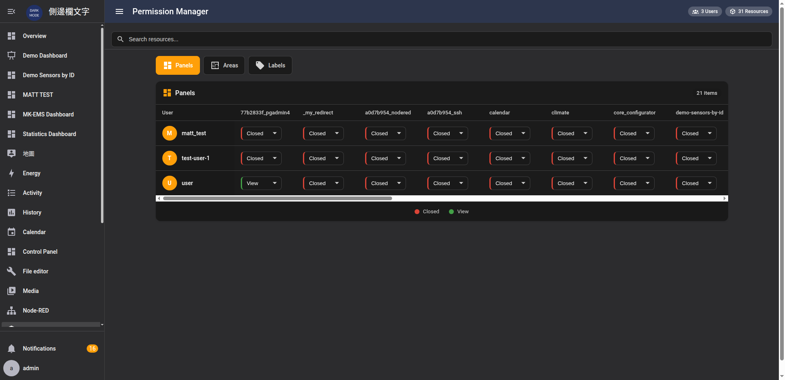
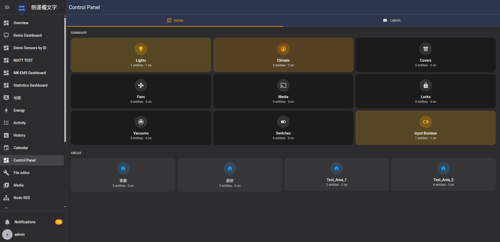

# Permission Manager for Home Assistant

[繁體中文](README_zh.md)

A Home Assistant custom integration that provides granular permission management for non-admin users. Control which sidebar panels, areas, and labels each user can access — all from a visual admin interface.

## Features

- **Panel Permissions** — Show or hide sidebar panels per user (dashboards, add-ons, tools, etc.)
- **Area Permissions** — Control which areas and their entities are visible to each user
- **Label Permissions** — Control which labels and their entities are visible to each user
- **Permission Matrix** — Visual admin panel with a spreadsheet-style matrix for quick configuration
- **Control Panel** — Unified dashboard showing area/label summaries with entity counts
- **Real-time Enforcement** — Sidebar filtering and content filtering applied immediately via JavaScript
- **Access Denied Pages** — Friendly redirect when users navigate to restricted panels
- **Store-based Persistence** — Permissions stored in `.storage/` (no entity pollution)
- **Event-driven Cleanup** — Automatically removes permissions when users/resources are deleted
- **Bilingual UI** — English and Traditional Chinese panel titles

## Screenshots

### Permission Matrix
Manage all user permissions from a single spreadsheet-style interface:

### Control Panel — Areas
View area summaries with entity counts grouped by domain:

### Control Panel — Labels
View label summaries with entity statistics:

## Requirements

- Home Assistant **2025.1.0** or newer
- At least one non-admin user to manage

## Installation

### HACS (Recommended)

1. Open HACS in your Home Assistant instance
2. Click the three-dot menu in the top right and select **Custom repositories**
3. Add `https://github.com/WOOWTECH/ha_permission_manager` as an **Integration**
4. Search for **Permission Manager** and click **Download**
5. Restart Home Assistant

### Manual

1. Download the `custom_components/ha_permission_manager` folder from this repository
2. Copy it to your Home Assistant `config/custom_components/` directory
3. Restart Home Assistant

## Configuration

1. Go to **Settings** > **Devices & Services**
2. Click **Add Integration** and search for **Permission Manager**
3. Follow the setup wizard — it will create the necessary storage and register the admin panels

No YAML configuration is required.

## Usage

### Permission Levels

| Level | Value | Description |
|-------|-------|-------------|
| **Closed** | 0 | Resource is hidden from the user |
| **View** | 1 | Resource is visible to the user |

### Panel Permissions

Panel permissions control which sidebar items a user can see. When a panel is set to **Closed**, it is removed from the user's sidebar and navigating to its URL directly will show an access denied page.

### Area Permissions

Area permissions control which areas are visible in the Control Panel. Entities belonging to restricted areas are filtered from the user's view.

### Label Permissions

Label permissions control which labels are visible in the Control Panel. Entities belonging to restricted labels are filtered from the user's view.

### Admin Users

Admin users always have full access — their permissions are not enforced. The Permission Manager panel itself is only visible to admin users.

## Troubleshooting

**Panel not appearing in sidebar after installation:**
Restart Home Assistant and clear your browser cache.

**Permission changes not taking effect:**
Changes are applied in real-time. Try refreshing the browser. If using a CDN or reverse proxy, cached pages may need to be invalidated.

**Users can still see restricted content briefly:**
The sidebar filter script runs after page load. A brief loading overlay is shown to prevent content flash.

## License

This project is licensed under the MIT License — see the [LICENSE](LICENSE) file for details.
